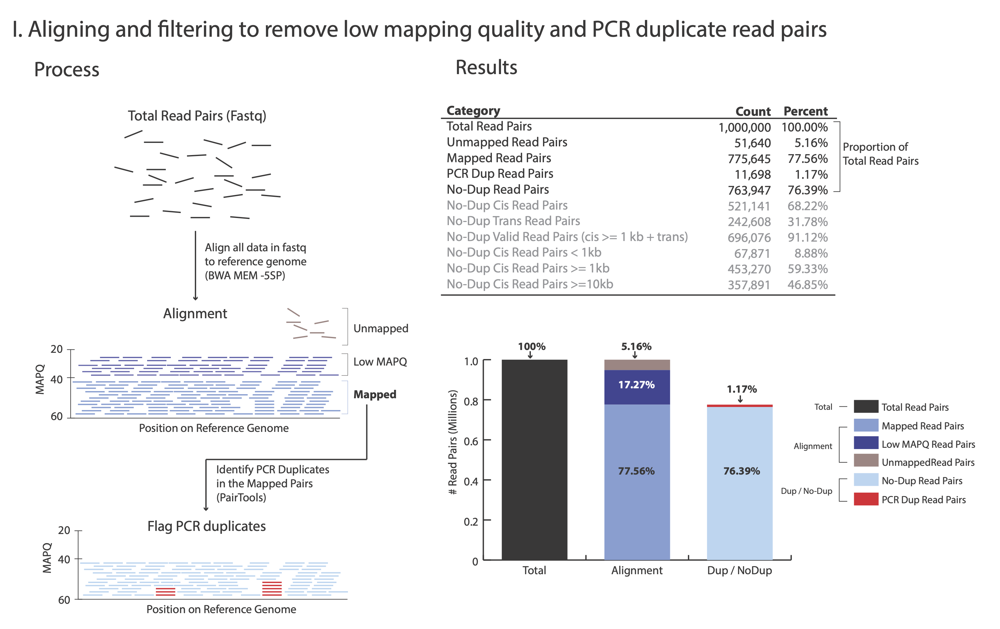
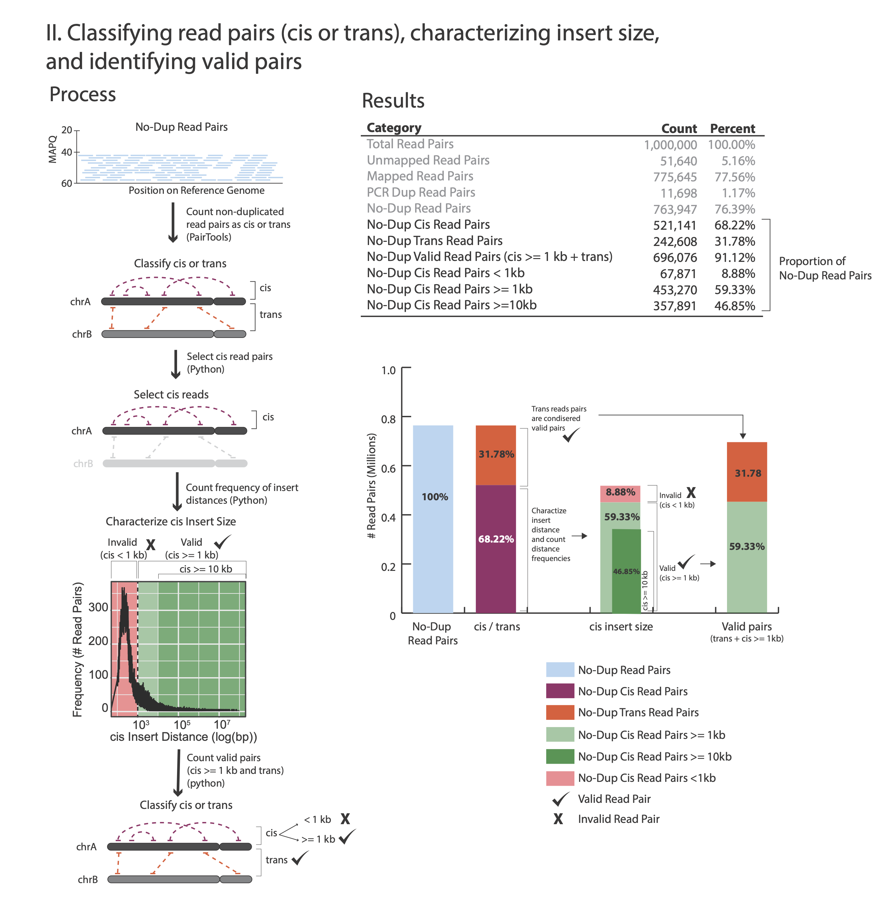
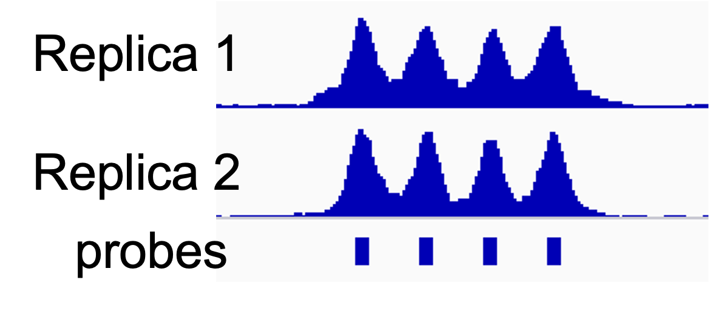
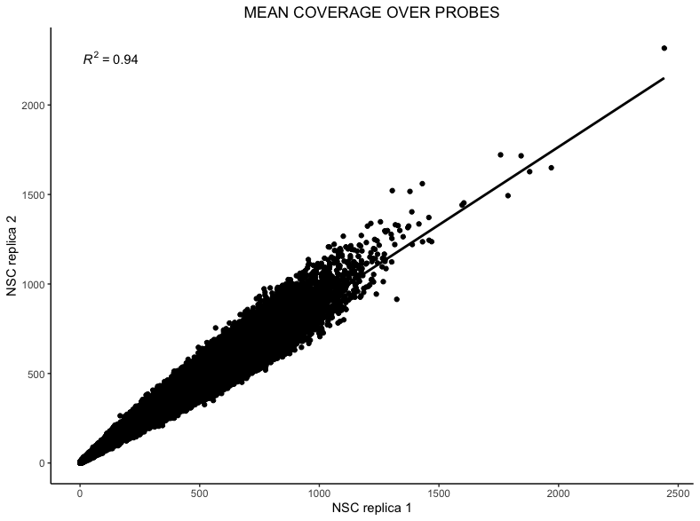

Quality Control & Sequencing Requirements
=========================================

Proximity ligation properties
-----------------------------

At step :ref:`Removing PCR duplicates<DUPs>` you used the flag ``--output-stats``, generating a stats file in addition to the pairsam output (e.g. --output-stats stats.txt). The stats file is an extensive output of pairs statistics as calculated by pairtools; including total reads, total mapped, total dups, and total pairs for each pair of chromosomes. Although you can directly use  the pairtools stats file as is to get informed on the quality of the Omni-C\ :sup:`®` \ or Micro-C\ :sup:`®` \ library, we find it easier to focus on a few key metrics. We include in this repository the script ``get_qc.py`` that summarize the paired-tools stats file and presents them in percentage values in addition to absolute values.

The figures below outline how the values on the QC report are calculated:

**Command:**

.. code-block:: console

   python3 ./capture/get_qc.py -p <stats.txt>

**Example:**

.. code-block:: console

   python3 ./capture/get_qc.py -p NSC_rep1_stats.txt 

After the script completes, it will output (if you ran the NSC rep1 sample you should expect to generate these same results):

.. code-block:: console

   Total Read Pairs                              1,000,000  100%
   Unmapped Read Pairs                           51,640     5.16%
   Mapped Read Pairs                             775,645    77.56%
   PCR Dup Read Pairs                            11,698     1.17%
   No-Dup Read Pairs                             763,947    76.39%
   No-Dup Cis Read Pairs                         521,141    68.22%
   No-Dup Trans Read Pairs                       242,806    31.78%
   No-Dup Valid Read Pairs (cis >= 1kb + trans)  696,076    91.12%
   No-Dup Cis Read Pairs < 1kb                   67,871     8.88%
   No-Dup Cis Read Pairs >= 1kb                  453,270    59.33%
   No-Dup Cis Read Pairs >= 10kb                 357,891    46.85%

- For each library, we recommend a minimum of 150 M **Total Read Pairs**
- Typically, **PCR Dup Read Pairs** range from 10% up to 35%
- **No-Dup Trans Read Pairs** are typically around 20% to 30% but lower or higher values alone are not reflective of poor library quality (e.g. 12%-35% are often observed with good quality libraries)
- **No-Dup Cis Read Pairs >= 1kb** is typically between 50% to 65%

Target enrichment QC
--------------------

To evaluate the level of target enrichment we will compare the coverage over the probes (targeted regions) and the overall fraction of the captured reads in our library. 

On-target rate 
++++++++++++++

We define the on-target rate as the percentage of read pairs that map to targeted regions. The on-target rate uses read pairs and not reads since due to proximity ligation, half of the read-pair is expected to map elsewhere in the genome, such that only one read from the pair maps to the targeted region. 

Since DNA fragments can extend beyond the sequenced region and as little as a 30 bp match is sufficient for capture, we treat reads that fall in close proximity to the targeted regions (up to 200 bp upstream or downstream from a probe) as on-target reads.

To count the number of on target pairs we will use:

 - :ref:`\*PT.bam <FTB>` file that you generated in the :ref:`previous section <FTB>` (not the CHiCAGO compatible bam) 

 - Bed file with the probe positions with 200 on both sides (the files h_probes_200bp_v1.0.bed for human and m_probes_200bp_v1.0.bed for mouse can be found in the datasets section).

Count on-target read pairs:

**Command:**

.. code-block:: console

   samtools view <*PT.bam file> -L <padded bed file> -@ <threads> \
   |awk -F "\t" '{print "@"$1}'|sort -u|wc -l 

**Example:**

.. code-block:: console

   samtools view NSC_rep1.PT.bam -L h_probes_200bp_v1.0.bed -@ 16|awk -F "\t" '{print "@"$1}'|sort -u|wc -l 
    
Samtools view with the ``-L`` argument enables the extraction of only the reads that mapped to the region of interest. The awk command helps us parse the file and extract the read ID information. The sort command with a ``-u`` (unique) argument will remove any multiple occurrences of the same read ID (to avoid counting read1 and read2 of the same pair if both mapped to the target region). And finally, ``wc -l`` counts the read IDs in this list.

The example above will output the value: 93,171,111 (**On-Target Read Pairs**)

There is no need to count the total read pairs in the bam file (which represents the total number of pairs, or 100%) as it was already reported by the QC script above, labeled as **No-Dup Read Pairs** (in our example: 144,094,911).

Now you can calculate the on-target rate:

.. math::

  \frac{On Target Read Pairs}{No Dup Read Pairs}*100

And in the example above:

.. math::

  \frac{93,171,111}{144,094,911}*100=64.7\%

The **on-target rate** of the NSC replica1 example library is 64.7%. This is a typical on target rate, although occasionally lower values may be observed (as low as 40%). 

Coverage depth
++++++++++++++

There are multiple methods and tools that enable the calculation of coverage depth from a bam file at different regions. We chose to use the tool `mosdepth <https://github.com/brentp/mosdepth>`_ as we find it to be easy to use and relatively fast.

Use the probe bed file (and bait bed file if desired) to calculate coverage using the position sorted bam file (e.g. mapped.PT.bam. Do not use the CHiCAGO compatible bam file):

.. _MOS:

**Command:**

.. code-block:: console

   mosdepth -t <threads> -b <bed file> -x <output prefix> -n <bam file>

**Example:**

.. code-block:: console

   mosdepth -t 16 -b h_probes_v1.0.bed -x NSC_rep1_probes -n NSC_rep1.PT.bam

This command will yield multiple output files. Specifically, two files useful for QC-ing your libraries are: **a)** a bed file detailing the mean coverage per region (region being probe location, based on the input bed file), e.g. NSC_rep1_probes.regions.bed.gz and **b)** a summary output file, e.g. NSC_rep1_probes.mosdepth.summary.txt. The summary file provides information on the mean coverage of the total genome (second to last row) and mean coverage of the total_region (targeted region of interest - the last row in the summary).
To print the header and two last summarizing rows, follow this example: 

.. code-block:: console

   head -1 NSC_rep1_probes.mosdepth.summary.txt;tail -2 NSC_rep1_probes.mosdepth.summary.txt

This will output the following:

.. code-block:: console

   chrom          length      bases       mean     min   max
   total          3088269832  39020721947 12.64    0     482767
   total_region   19337280    7835787504  405.22   0     8129

In this example (NSC rep1), the mean coverage over targeted regions is 405.22, while non-targeted regions have a mean coverage depth of only 12.64. Overall, the coverage depth is 32 times higher at targeted regions vs non-targeted regions: :math:`405.22/12.64 = 32`. The fold difference between the mean coverage depth of targeted regions and non-targeted regions is typically around 30, just as seen in this example. 

The bed files with mean coverage values at on-target regions (e.g. NSC_rep1_probes.regions.bed.gz and NSC_rep2_probes.regions.bed.gz) will be used to assess :ref:`replica reproducibility <RR>`.

|clock| Running the QC steps can be completed in less than 2 hours on an Ubuntu 18.04 machine with 16 CPUs, 1TB storage and 64GB memory.

.. _RR:

Replica Reproducibility
-----------------------

It is highly recommended that 2-4 replicas be generated for each condition (e.g. cell type, treatment etc.) in your experiment. Our experience shows that Pan Promoter Enrichment Panel experiments are highly reproducible and that coverage over probes and baits is highly correlated between replicas.

To calculate the :math:`R^2` value of mean coverage between replicas, you can use the the :ref:`output mosdepth bed files <MOS>` (ends with regions.bed.gz) that are generated in the QC step`. 

In the QC step` we guided you to generate a coverage profile of probe regions. When evaluating reproducibility between samples you may be interested, in addition, to evaluate the coverage reproducibility across the bait regions (in most cases one promoter is represented by one bait, or, alternatively, by 4 probes). You can simply repeat the :ref:`mosdepth command <MOS>` with the bait file (e.g. https://s3.amazonaws.com/dovetail.pub/capture/human/h_baits_v1.0.bed) in place of the probe bed file. 

The last column in the mosdepth output bed file (e.g. NSC_rep1_probes.regions.bed.gz) specifies the mean coverage at each bait or probe location. You can import the last column for each replica of interest to excel, R data frame, or your choice of statistical tool to calculate :math:`R^2` values. In the example below, you can find guidelines for plotting the coverage information of one replica vs. another for calculating the :math:`R^2` value.

**In your R console:**

.. code-block:: r

   library(tidyverse) 
   library(ggplot) #for plotting coverage values of rep1 vs rep2 
   library(ggpmisc) #for adding regression values to the plot

   #read coverage information of rep1 (output bed file from mosdepth step) and rename columns 
   NSC_rep1_probes <- read.table(gzfile("NSC_rep1_probes.regions.bed.gz"),sep="\t", header=FALSE)
   NSC_rep1_probes <-rename(NSC_rep1_probes, chr = V1, start = V2, end = V3, probe = V4, rep1_coverage = V5)
   
   #read coverage information of rep2 (output bed file from mosdepth step) and rename columns 
   NSC_rep2_probes <- read.table(gzfile("NSC_rep2_probes.regions.bed.gz"),sep="\t", header=FALSE)
   NSC_rep2_probes <-rename(NSC_rep2_probes, chr = V1, start = V2, end = V3, probe = V4, rep2_coverage = V5)

   #combine replicates into one data frame
   df<-full_join(NSC_rep1_probes,NSC_rep2_probes)

   #Plot coverage of probes of replica1 vs replica2
   ggplot(df, aes(x = rep1_coverage, y = rep2_coverage)) + geom_point()

   #calculate R-squared value 
   cor(df$rep1_coverage,df$rep2_coverage)^2

   #Alternatively, you can add the regression function and the R-squared value to the graph:

   ggplot(df, aes(x = rep1_coverage, y = rep2_coverage)) + geom_point() + stat_smooth(method = "lm", color = "black", formula = y ~ x) + stat_poly_eq (formula = y ~ x)

   #Final plot (with title and no background)

   ggplot(df, aes(x = rep1_coverage, y = rep2_coverage)) + geom_point() + stat_smooth(method = "lm", color = "black", formula = y ~ x) + stat_poly_eq (formula = y ~ x) + labs(title="MEAN COVERAGE OVER PROBES",x="NSC replica 1", y = "NSC replica 2") + theme_classic() + theme(plot.title = element_text(hjust = 0.5))

Typically :math:`R^2` values for mean probe coverage are around 0.9 (ranging from 0.85 - 0.95) and :math:`R^2` values for mean bait coverage are around 0.95 (ranging from 0.95 - 0.99).
