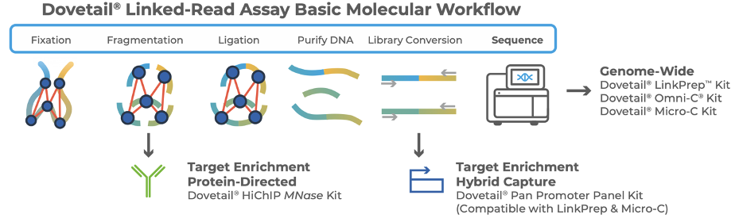
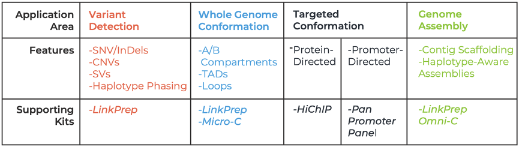
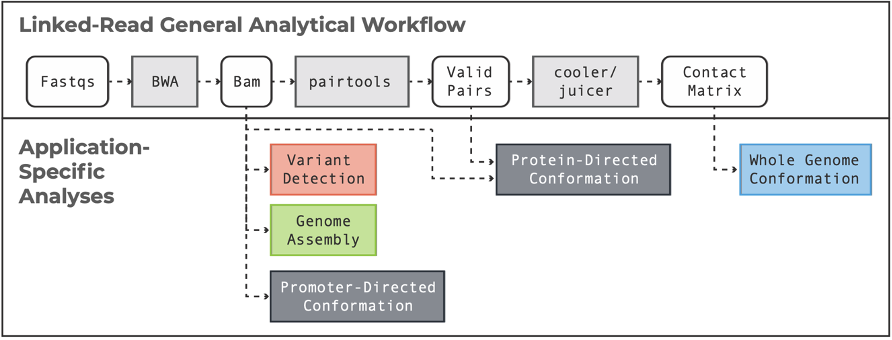

Welcome to the Dovetail® Linked-Read Analysis Page
==================================================

Dovetail® Linked-Read technology enables powerful multi-omic insight from proximity-ligated DNA, supporting a broad range of genomic 
applications — including variant detection, 3D genome conformation, and haplotype-aware genome assembly. This guide serves as a 
centralized resource for analyzing datasets generated using Dovetail Linked-Reads, integrating workflows across multiple applications 
and existing product-specific documentation.

Molecular Biology of the Sequence Data
--------------------------------------

The Dovetail Linked-Read assays generate proximity ligated chromatin that is then purified and converted into a sequencing library.
Depending on the application, DNA can be analyzed genome-wide or enriched by protein-directed or hybrid capture-based strategies.
No matter the Dovetail® product used, the sequencing data consist of chimeric molecules with insert sizes reflecting the chromatin
structure in the nucleus. 

Application Areas & Supporting Products
---------------------------------------

The flexible nature of these data supports multiple downstream applications through a unified experimental framework. Applications
can be supported by various Dovetail® Linked-Read Products. Below is a guide to these applications and their supporting chemistries.

Workflow Overview
-----------------

The general analytical workflow starts with raw FASTQ files that are aligned with standard tools to the reference genome of interest,
and then filtered for valid interaction pairs. From there, users can branch into analysis workflows tailored for:
•	Variant Detection
•	Whole Genome Conformation
•	Targeted Conformation
•	Genome Assembly
•	Haplotype Phasing

This guide brings together these application-specific workflows in a single documentation hub, with links to detailed product-specific pages.

What's in this guide
--------------------

•	Guidance on input formats and pre-processing
•	Optimized data processing for workflows tailored to the Dovetail® Linked-Read Chemistries
•	Application-specific documentation
•	Best practices and tips for optimal data quality

Support
-------

For help or related questions please open a new issue in the github repository or send an email to: support@cantatabio.com 

.. toctree::
   :maxdepth: 2
   :caption: Data Processing

   data_processing/before_you_begin
   data_processing/pre_alignment
   data_processing/fastq_to_bam
   data_processing/contact_map

.. toctree::
   :maxdepth: 3
   :caption: Whole Genome Sequencing

   whole_genome/qc
   whole_genome/genetic_variant_detection
   whole_genome/topology
   whole_genome/comparative_analysis
   whole_genome/phasing
   whole_genome/genome_assembly
   whole_genome/data_sets_wgs

.. toctree::
   :maxdepth: 2
   :caption: HiChIP

   hichip/qc
   hichip/loop_calling
   hichip/comparative_analysis
   hichip/plot_arc
   hichip/1D_peak
   hichip/data_sets_hichip

.. toctree::
   :maxdepth: 2
   :caption: Capture

   capture/qc
   capture/loop_calling
   capture/comparative_analysis
   capture/data_sets_cap