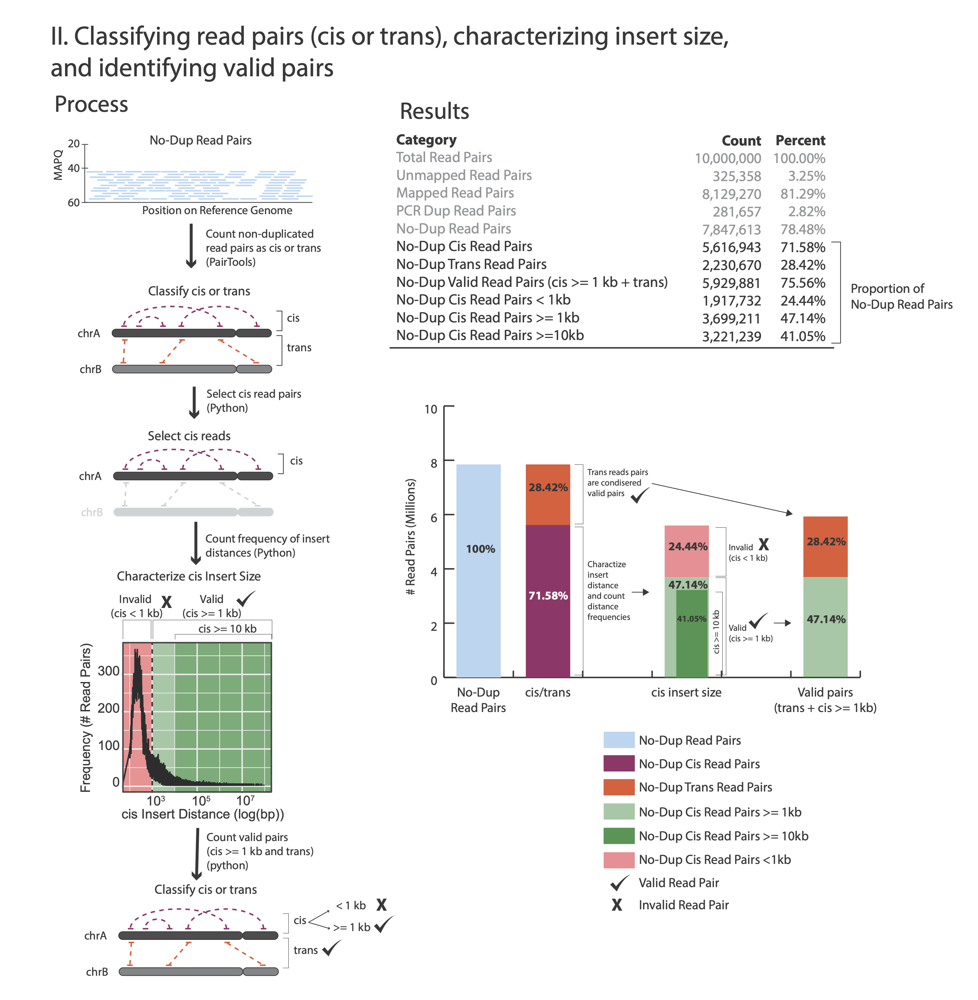

Quality Control & Sequencing Requirements
=========================================

At step :ref:`Removing PCR duplicates<DUPs>` you used the flag `--output-stats`, generating a stats file in addition to the pairsam output (e.g. --output-stats stats.txt). The stats file is an extensive output of pairs statistics as calculated by pairtools, including total reads, total mapped, total dups, total pairs for each pair of chromosomes etc'. Although you can use directly the pairtools stats file as is to get informed on the quality of the LinkPrep library, we find it easier to focus on a few key metrics. We include in this repository the script ``get_qc.py`` that summarize the paired-tools stats file and present them in percentage values in addition to absolute values.

The images below explains how the values on the QC report are calculated:

**Command:**

.. code-block:: console

   python3 ./LinkPrep/get_qc.py -p <stats.txt>

**Example:**

.. code-block:: console

   python3 ./LinkPrep/get_qc.py -p stats.txt 

After the script completes, it will print:

.. code-block:: console

   Total Read Pairs                              10,000,000  100%
   Unmapped Read Pairs                           325,358     3.25%
   Mapped Read Pairs                             8,129,270   81.29%
   PCR Dup Read Pairs                            281,912     2.82%
   No-Dup Read Pairs                             7,847,358   78.47%
   No-Dup Cis Read Pairs                         5,616,689   71.57%
   No-Dup Trans Read Pairs                       2,230,669   28.43%
   No-Dup Valid Read Pairs (cis >= 1kb + trans)  5,929,880   75.57%
   No-Dup Cis Read Pairs < 1kb                   1,917,478   24.43%
   No-Dup Cis Read Pairs >= 1kb                  3,699,211   47.14%
   No-Dup Cis Read Pairs >= 10kb                 3,221,239   41.05%

Complexity
----------

If you performed a shallow sequencing experiment (e.g. 10M reads) and running a QC analysis to decide which library to use for deep sequencing (DS), it is recommended to evaluate the complexity of the library before moving to DS. 

To do this, you will need to supply the raw aligned bam prior to duplicates removal. Recall the first alignment step in :ref:`fastq to final valid pairs bam file - step by step<step-by-step>`.
To prepare the raw alignment for complexity estimation, you must first sort and index the `aligned.sam` alignment file:

.. code-block:: console

   # sort and convert to bam file
   samtools view -bS aligned.sam | samtools sort -@16 -T ./tmp/temp2.bam -o aligned.sorted.bam -
   
   # index
   samtools index aligned.sorted.bam

The `lc_extrap` utility of the `preseq` package aims to predict the complexity of sequencing libraries. 

``preseq`` options:

.. csv-table::
   :file: tables/preseq.csv
   :header-rows: 1
   :widths: 20 20 60
   :class: tight-table

``preseq lc_extrap`` command example for extrapolating library complexity:

**Example:**

.. code-block:: console

   preseq lc_extrap  -B -P -e 2.1e9 -step 1e8 -output out.preseq aligned.sorted.bam

In this example the output file out.preseq will detail the extrapolated complexity curve of your library, with the number of reads in the first column and the expected distinct read value in the second column. For a typical experiment (human sample) check the expected complexity at 400M reads (to show the content of the file, type cat out.preseq). Expected unique pairs at 400M sequencing is at least ~ 220 million

QC Assessment
-------------

- Pass/No Pass Metrics

  - No-Dup Cis Read Pairs >= 1kb – This value demonstrates that the proximity-ligation step was successful, and the majority of the data are useful in downstream analyses (e.g. loop calling).
  - For Shallow QC Sequencing Complexity at 400M Read Pairs – This value informs how many unique reads a library can support.
  - For Deep - sequencing No-Dup Read Pairs

- Pass/No Pass Values 

  - The table below summarizes the minimum passing values for the metrics defined above. The cut-off values were determined for both shallow sequenced (10 million read pairs 2 x 150 bp) and deep sequenced data (200-300 Million read pairs 2 x 150 bp).

+--------------------------------+-----------------------------+----------------------------------------------+
| Metric                         | Shallow Sequencing          | Deep Sequencing                              |
+================================+=============================+==============================================+
| No-Dup Cis Read Pairs >= 1kb   | >40% of no-dup read pairs   | >40% of no-dup read pairs                    |
+--------------------------------+-----------------------------+----------------------------------------------+
| Complexity @ 400M Read Pairs   | >125 million                | NA                                           |
+--------------------------------+-----------------------------+----------------------------------------------+
| No-Dup Read Pairs              | NA                          | >125 million                                 |
+--------------------------------+-----------------------------+----------------------------------------------+

Sequencing Recommendations
--------------------------

**Topological Feature Calling**

LinkPrep was designed to support looping calling with one sample. This requires generating four libraries from a single proximity-ligation reaction. This does not mean you need to sequence all four libraries. The amount of sequencing and the number of libraries you need to to sequence is dependent on the feature you are trying to detect and the resolution (or bin size) you wish to call features at. The table below outlines the number of libraries, total sequencing depth in read pairs, and how many read pairs are needed per library, and finally the minimal amount of no-dup read pairs summed across the libraries for each feature at given resolutions:

+------------------+--------------+-------------------+--------------------+--------------------------------+--------------------------------------------------------+
| Feature          | Resolution   | Total # libraries | Total # read pairs | Total # read pairs per library | Minimal # of no-dup read pairs summed across libraries |
+==================+==============+===================+====================+================================+========================================================+
| A/B Compartments | 50-100 kb    | 1                 | 200 Million        | 200 Million                    | >80 Million                                            |
+------------------+--------------+-------------------+--------------------+--------------------------------+--------------------------------------------------------+
| TADS             | 25 kb        | 2                 | 400 Million        | 200 Million                    | >150 Million                                           |
+------------------+--------------+-------------------+--------------------+--------------------------------+--------------------------------------------------------+
|                  | 10 kb        | 2                 | 600 Million        | 300 Million                    | >300 Million                                           |
+------------------+--------------+-------------------+--------------------+--------------------------------+--------------------------------------------------------+
|                  | 5 kb         | 4                 | 800 Million        | 200 Million                    | >400 Million                                           |
+------------------+--------------+-------------------+--------------------+--------------------------------+--------------------------------------------------------+
| Loops            | 10 kb        | 4                 | 800 Million        | 200 Million                    | >400 Million                                           |
+------------------+--------------+-------------------+--------------------+--------------------------------+--------------------------------------------------------+
|                  | 5 kb         | 4                 | 1200 Million       | 300 Million                    | >500 Million                                           |
+------------------+--------------+-------------------+--------------------+--------------------------------+--------------------------------------------------------+

To generate the most complete matrix you can from a single 500 thousand cell input, you need sequence 4 libraries to a total of 1200 million read pairs (300 million per library).

**Variant Calling**

LinkPrep was designed to enable flexibility around sequence depth as different classes of variants require differing sequence depth to confidently call. For large structural variants such as translocations or gains and losses >1mb, only 5-10X genomic coverage is required. For SNV and INDELs, a more WGS application, we recommend similar sequencing depths as shotgun libraries which is 30-40X genomic coverage. Also keep in mind that tumor purity can play a role in how sequencing depth can impact detection capabilities.

+---------------------------+---------------------------------------------+
| Feature                   | Sequencing Depth    | Tumor Purity          |
+===========================+=====================+=======================+
| SVs & CNVs Only           | 50-100M read pairs  | Samples > 20% purity  |
+---------------------------+---------------------+-----------------------+
| SVs, CNVs, INDELs, & SNVs | 300-400M read pairs | Samples > 50% purity* |
+---------------------------+---------------------+-----------------------+

* for samples with lower tumor purity - additional library and more sequencing is recommended

**Genome Assembly and Phasing**

Sequencing requirements for genome assembly will vary depending on the size of the genome for your organism. We recommend a sequencing depth of 15X per haplotype.

+---------------------------+-----------------------------------+
| Organism                  | Genome Size | Sequencing Depth    |
+===========================+=============+=====================+
| Human (Diploid)           | ~3 Gb       | 300-400M read pairs |
+---------------------------+-------------+---------------------+
| Mouse (Diploid)           | ~2.7 Gb     | 300-400M read pairs |
+---------------------------+-------------+---------------------+